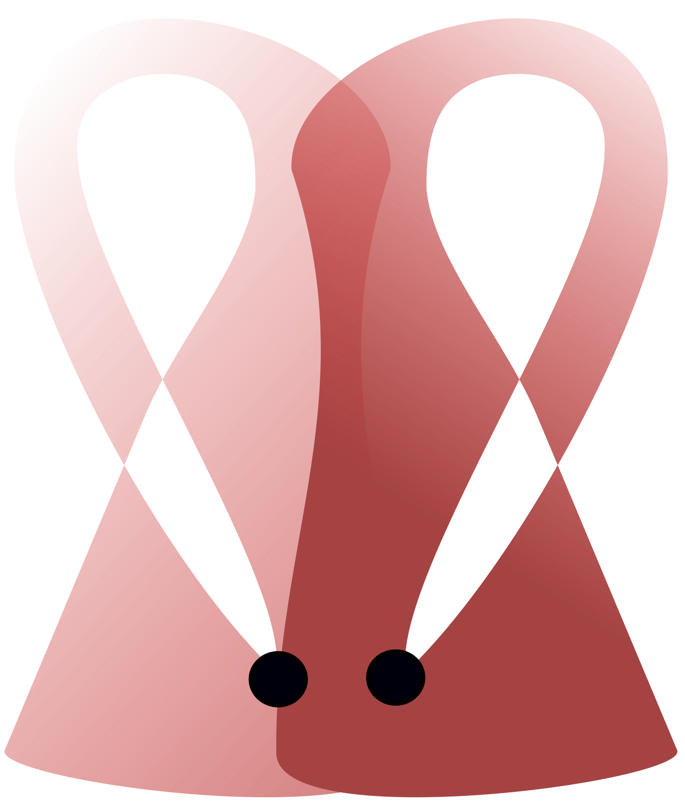

[REDCapR](https://github.com/OuhscBbmc/REDCapR)  
=======

We’ve been using R with [REDCap](https://projectredcap.org/)'s API since 2012 and have developed   [`REDCapR`](https://github.com/OuhscBbmc/REDCapR).  Before encapsulating these functions in a package, we were replicating 50+ lines of code to contact REDCap and robustly transform the returned [csv](https://en.wikipedia.org/wiki/Comma-separated_values) into an R `data.frame`; it took twice that much to implement batching.  All this can be done in one call to [`redcap_read()`](https://ouhscbbmc.github.io/REDCapR/reference/redcap_read.html):

```r
ds <- redcap_read(redcap_uri=uri, token=token)$data
```

The [`redcap_read()`](https://ouhscbbmc.github.io/REDCapR/reference/redcap_read.html) function also accepts values for subsetting/filtering the records and fields.  Here are two examples; the first selects only a portion of the rows, while the second selects only a portion of the columns.  Documentation for the additional 20+ functions are found at [ouhscbbmc.github.io/REDCapR/reference](https://ouhscbbmc.github.io/REDCapR/reference/).

```r
# Return only records with IDs of 1 and 4
desired_records <- c(1, 4)
ds_some_rows <- redcap_read(
  redcap_uri   = uri,
  token        = token,
  records      = desired_records
)$data

# Return only the fields record_id, name_first, and age
desired_fields <- c("record_id", "name_first", "age")
ds_some_fields <- redcap_read(
  redcap_uri  = uri,
  token       = token,
  fields      = desired_fields
)$data
```

The `REDCapR` package includes the SSL certificate retrieved by [`httr::find_cert_bundle()`](https://github.com/r-lib/httr/blob/main/R/utils.r).  Your REDCap server's identity is always verified, unless the setting is overridden (alternative certificates can also be provided).

To keep our maintenance efforts manageable, the package implements only the REDCap API functions that have been requested.  If there's a feature that would help your projects, please tell us in a new issue in REDCapR's [GitHub repository](https://github.com/OuhscBbmc/REDCapR/issues).  A [troubleshooting](https://ouhscbbmc.github.io/REDCapR/articles/TroubleshootingApiCalls.html) document helps diagnose issues with the API.


### Installation and Documentation

The *release* version can be installed from [CRAN](https://cran.r-project.org/package=REDCapR).
```r
install.packages("REDCapR")
```

The *development* version can be installed from [GitHub](https://github.com/OuhscBbmc/REDCapR) after installing the `remotes` package.

```r
install.packages("remotes") # Run this line if the 'remotes' package isn't installed already.
remotes::install_github("OuhscBbmc/REDCapR")
```
The  [ouhscbbmc.github.io/REDCapR](https://ouhscbbmc.github.io/REDCapR/) site describes the package functions, and includes documents involving [basic operations](https://ouhscbbmc.github.io/REDCapR/articles/BasicREDCapROperations.html), [advanced operations](https://ouhscbbmc.github.io/REDCapR/articles/advanced-redcapr-operations.html), [token security](https://ouhscbbmc.github.io/REDCapR/articles/SecurityDatabase.html), and
[troubleshooting](https://ouhscbbmc.github.io/REDCapR/articles/TroubleshootingApiCalls.html).

Also checkout the other packages that exist for communicating with REDCap, which are listed in the [REDCap Tools](https://redcap-tools.github.io/projects/) directory.


### Collaborative Development
We encourage input and collaboration.  If you're familiar with GitHub and R packages, feel free to submit a [pull request](https://github.com/OuhscBbmc/REDCapR/pulls).  If you'd like to report a bug or make a suggestion, please create a GitHub [issue](https://github.com/OuhscBbmc/REDCapR/issues); issues are a usually a good place to ask public questions too.  However, feel free to email Will (<wibeasley@hotmail.com>).  Please note that this project is released with a [Contributor Code of Conduct](https://github.com/OuhscBbmc/REDCapR/blob/main/CONDUCT.md); by participating in this project you agree to abide by its terms.  We have some starting material described in the [`./documentation-for-developers/`](https://github.com/OuhscBbmc/REDCapR/tree/main/documentation-for-developers) directory.

We'd like to thank the following developers for their [advice](https://github.com/OuhscBbmc/REDCapR/issues?q=is%3Aissue+is%3Aclosed) and [code contributions](https://github.com/OuhscBbmc/REDCapR/graphs/contributors): [Benjamin Nutter](https://github.com/nutterb), [Rollie Parrish](https://github.com/rparrish), [Scott Burns](https://github.com/sburns), [John Aponte](https://github.com/johnaponte), [Andrew Peters](https://github.com/ARPeters), and [Hao Zhu](https://github.com/haozhu233).

### Funders

Much of this package has been developed to support the needs of the following projects.  We appreciate the support.  (So far) the primary developers of REDCapR are the external evaluators for [Oklahoma's MIECHV](https://oklahoma.gov/health/health-education/children---family-health/family-support-and-prevention-service/miechv-program-federal-home-visiting-grant.html) program.  See the preliminary CQI reports (many of which use REDCapR) at <https://ouhscbbmc.github.io/MReportingPublic/>.

* *OUHSC CCAN Independent Evaluation of the State of Oklahoma Competitive Maternal, Infant, and Early Childhood Home Visiting ([MIECHV](https://mchb.hrsa.gov/programs-impact/programs/home-visiting/maternal-infant-early-childhood-home-visiting-miechv-program)) Project*. HRSA/ACF D89MC23154.  David Bard, PI, OUHSC; 2011-2015.
* *Independent Evaluation of the State of OK MIECHV Evidence Based Home Visitation Project*, [NIH](https://www.nih.gov/)-sponsored collaboration with [OSDH](https://oklahoma.gov/health.html). David Bard, PI, OUHSC; 2015-2017.
* *OSDH ParentPRO Pilot Evaluation*, federally-sponsored collaboration with [OSDH](https://oklahoma.gov/health.html).  David Bard, PI, OUHSC; 2015-2017.
* *Title IV-E Waiver Project*, [HRSA/MCHB](https://mchb.hrsa.gov/)-sponsored collaboration with [OKDHS](https://oklahoma.gov/okdhs.html); David Bard, PI, OUHSC; 2014-2017.
* *Integrative Analysis of Longitudinal Studies of Aging (IALSA)*, sponsored by [NIH 5P01AG043362](https://grantome.com/grant/NIH/P01-AG043362).  Scott Hofer, PI, University of Victoria; Will Beasley, PI of site-award, OUHSC; 2013-2018.
* *Oklahoma Shared Clinical and Translational Resources*, sponsored by [NIH NIGMS; U54 GM104938](https://grantome.com/grant/NIH/U54-GM104938). Judith A. James, PI, OUHSC; 2013-2018.
* *Oklahoma Shared Clinical and Translational Resources*, sponsored by [NIH U54GM104938](https://taggs.hhs.gov/Detail/AwardDetail?arg_AwardNum=U54GM104938&arg_ProgOfficeCode=127); 2020-2021.
* Additional Institutional Support from OUHSC [Dept of Pediatrics](https://medicine.ouhsc.edu/Academic-Departments/Pediatrics); 2013-2021.

Thanks,
[Will Beasley](https://orcid.org/0000-0002-5613-5006), 
[David Bard](https://orcid.org/0000-0002-3922-8489), 
& Thomas Wilson<br/>
[University of Oklahoma Health Sciences Center](https://www.ouhsc.edu/),
[Department of Pediatrics](https://medicine.ouhsc.edu/Academic-Departments/Pediatrics),
[Biomedical & Behavioral Research Core](https://www.ouhsc.edu/BBMC/).

### Build Status and Package Characteristics

| [Branch](https://github.com/OuhscBbmc/REDCapR) | [GitHub Actions](https://github.com/OuhscBbmc/REDCapR/actions) | [Codecov](https://app.codecov.io/gh/OuhscBbmc/REDCapR) |
| :----- | :---------------------------: | :-------: |
| [Main](https://github.com/OuhscBbmc/REDCapR/tree/main) | [](https://github.com/OuhscBbmc/REDCapR/actions) |  [](https://app.codecov.io/gh/OuhscBbmc/REDCapR/branch/main) |
| [Dev](https://github.com/OuhscBbmc/REDCapR/tree/dev) | [](https://github.com/OuhscBbmc/REDCapR/actions) | [](https://app.codecov.io/gh/OuhscBbmc/REDCapR/branch/dev) |
| | *Ubuntu Latest* | *Test Coverage* |

| Key | Value |
| :--- | :----- |
| [License](https://choosealicense.com/) | [](https://choosealicense.com/licenses/mit/) |
| [CRAN Version](https://cran.r-project.org/package=REDCapR) | [](https://cran.r-project.org/package=REDCapR) |
| [CRAN Rate](https://cranlogs.r-pkg.org/) |  |
| [Zenodo Archive](https://zenodo.org/search?ln=en&p=redcapr) | [](https://doi.org/10.5281/zenodo.61990) |
| [Production Doc](https://www.rdocumentation.org/) | [](https://www.rdocumentation.org/packages/REDCapR) |
| [Development Doc](https://ouhscbbmc.github.io/REDCapR/) | [](https://ouhscbbmc.github.io/REDCapR/) |
