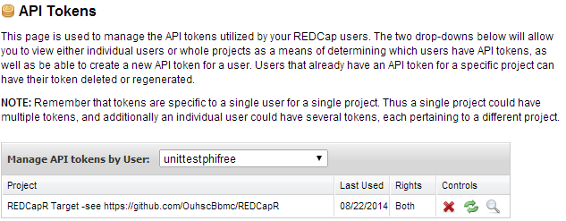

```{r}
#| include = FALSE
knitr::opts_chunk$set(
  collapse = TRUE,
  comment = "#>",
  tidy    = FALSE
)
```

There are many links in the pipeline between your institution's [REDCap](https://projectredcap.org/) server and the API user.  When the end result is unsuccessful, this document should help narrow the location of the possible problem.  The first two sections will be relevant to almost any language interacting with the API.  The remaining sections are possibly relevant only to your language (*e.g.*, Python, R, PHP, SAS, bash), or your software library such as [redcapAPI](https://github.com/nutterb/redcapAPI) and [REDCapR](https://ouhscbbmc.github.io/REDCapR/) in R, [phpcap](https://github.com/iuredcap/phpcap) in PHP, and [PyCap](https://pypi.org/project/pycap/) in Python).

Language Agnostic
==================================================================

Server Configuration and Authorization
------------------------------------------------------------------

This first group of checks primarily focuses on the server and the logins accounts.  Unlike later sections, REDCap administrator privileges are necessary for most of these checks.

1. **Do you have an account for the *server*?**  This can be verified in the `Browse Users` section of the server's `Control Center`.

    * If you're a REDCap admin, put yourself in the user's position --does the user have an account?

    * If you're a typical user, you may have to consult with your institution's REDCap administrator for some of these checks.

1. **Do you have permissions for the specific *project*?** This can be verified in the `User Rights` section within the project.  Notice that it's possible (but ultimately not useful) to have an account here, but not with the server, so don't skip the previous step.

1. **Can you log in normally through the interface?** However if the username and password aren't working, the API theoretically might still work because it uses their token instead of their password.

1. **Have you verified your account by responding to the automated email sent to them?** This can be verified in the `Browse Users` section of your server's `Control Center`.  (Talk to your REDCap admin.) For each email address you've entered, there should be a green 'Verified' label and icon.

    ```{r EmailVerified}
    #| echo = FALSE,
    #| fig.alt = 'verified email screen shot',
    #| out.extra = 'style = "fig.width=400px"'
    knitr::include_graphics("images/EmailVerified.png")
    ```

    <!---->

1. **Have you been granted the desired import and/or export permissions?** This can be verified in the `User Rights` section or in the `API` section (and it's `Manage All Project Tokens` tab) within the project.  Alternatively, it can be verified in the `API Tokens` section of the server's `Control Center`.

    ```{r ApiPrivilegeDashboard}
    #| echo = FALSE,
    #| fig.alt = 'tokens screen shot',
    #| out.extra = 'style = "fig.width=600px"'
    
    ```

    <!---->

1. **Are you using the correct token?** This can be verified in the `API` section (and it's `Manage All Project Tokens` tab) within the project.  Click the magnifying glass icon in the user's row.  Alternatively, it can be verified in the `API Tokens` section of the server's `Control Center`.

    ```{r MagnifyingGlass}
    #| echo = FALSE,
    #| fig.alt = 'magnifying screen shot',
    #| out.extra = 'style = "fig.width=550px"'
    knitr::include_graphics("images/MagnifyingGlass.png")
    ```

    <!---->

If all these checks pass, proceed to the next section.  If not, start by consulting with your REDCap administrator.

Reading
------------------------------------------------------------------

This section examines potential problems that occur after data leaves a working server, but before it is handled by their programming language (*e.g.*, Python and R).  [Postman](https://www.postman.com/) is a Chrome plugin recommended by [several](https://groups.google.com/forum/#!searchin/project-redcap/postman/project-redcap/eYK_SLzW2k4/0hmf8vWLpdAJ) [people](https://groups.google.com/forum/#!searchin/project-redcap/postman/project-redcap/RdLeRFGqzbg/WgdjTBLph1kJ) that makes troubleshooting much more efficient.

```{r PostmanScreenshot}
#| echo = FALSE,
#| fig.alt = 'PostMan screen shot',
#| out.extra = 'style = "fig.width=800px"'
knitr::include_graphics("images/PostmanScreenshot.png")
```

<!---->

1. **Is the API Playground producing the expected result?**  REDCap's "API Playground" holds your hand by (a) offering a dropdown list of API methods available to your REDCap instance, and (b) presenting a series of dropdown boxes appropriate for the selected method. Find it through the API link visible in the left margin of REDCap.  When you've completed the inputs, click 'Execute' to view the plain-text returned by the server.

    At the bottom of the playground page, the interface attempts to translate your specific API call to different languages, like Python and R.  These suggestions are usually correct, but  inspect it critically, as you would for any auto-generated script.

1. **Is the URL/URI correct?**  Notice the url typically ends with "api/" so it resembles `https://redcap.ouhsc.edu/redcap/api/` and *not* `https://redcap.ouhsc.edu/` (even if <https://redcap.ouhsc.edu/> redirects to <https://redcap.ouhsc.edu/redcap/>).

1. **Is Postman installed and operating correctly?**  If it helps to start with a different REDCap server, you can use this dummy project containing fake data hosted by the [OUHSC BBMC](https://www.ouhsc.edu/bbmc/).  The url is `https://redcap-dev-2.ouhsc.edu/redcap/api/`.  There are three key-value pairs: (1) the 'token' is `9A068C425B1341D69E83064A2D273A70`, (2) the 'content' is `record`, and (3) the 'format' should be `CSV`.  When checking your own server, the token value should change, but the content and format should not.  It should return five records in a CSV format.  The 'status' should be `200 OK`.  The result should look roughly like this.  Notice the line breaks were included in the text values themselves.

    ```csv
    record_id,name_first,name_last,address,telephone,email,dob,age,ethnicity,race,sex,height,weight,bmi,comments,demographics_complete
    "1","Nutmeg","Nutmouse","14 Rose Cottage St.
    Kenning UK, 323232","(432) 456-4848","nutty@mouse.com","2003-08-30",10,1,2,0,5,1,400,"Character in a book, with some guessing",2
    "2","Tumtum","Nutmouse","14 Rose Cottage Blvd.
    Kenning UK 34243","(234) 234-2343","tummy@mouse.comm","2003-03-10",10,1,6,1,6,1,277.8,"A mouse character from a good book",2
    "3","Marcus","Wood","243 Hill St.
    Guthrie OK 73402","(433) 435-9865","mw@mwood.net","1934-04-09",79,0,4,1,180,80,24.7,"completely made up",2
    "4","Trudy","DAG","342 Elm
    Duncanville TX, 75116","(987) 654-3210","peroxide@blonde.com","1952-11-02",61,1,4,0,165,54,19.8,"This record doesn't have a DAG assigned

    So call up Trudy on the telephone
    Send her a letter in the mail",2
    "5","John Lee","Walker","Hotel Suite
    New Orleans LA, 70115","(333) 333-4444","left@hippocket.com","1955-04-15",58,1,4,1,193.04,104,27.9,"Had a hand for trouble and a eye for cash

    He had a gold watch chain and a black mustache",2
    ```

1. **Can an administrator query the API successfully with Postman with the admin token?** As an administrator, create an account for yourself, and verify that your token works on your server and project.

1. **Can an administrator query the API successfully with Postman with the user's token?** Use [Postman](https://www.postman.com/) as before, but replace your token with the user's token.  Once the whole problem is solved, reissue new API tokens to both you and the user.

1. **Can a user query the API successfully with Postman with the their own token?** The values you enter should be exactly the same as those entered in the previous step.  A failure here (assuming the previous step was successful) suggests a network or firewall issue.  If the server is behind your institution's firewall, verify the you are connecting successfully through the VPN.

1. **Can a user query the API with cURL?**  [cURL](https://curl.se/) is a command line tool that's underneath a lot of libraries.  If it's installed correctly on your location machine, it can be executed from the terminal or command line.

    ```shell
    curl -X POST -H "Cache-Control: no-cache" -F "token=9A068C425B1341D69E83064A2D273A70" -F "content=record" -F "format=csv" "https://redcap-dev-2.ouhsc.edu/redcap/api/"
    ```

If all these checks pass, proceed to the next section.  If not, start by consulting with your REDCap administrator.  If that fails, consider creating a GitHub issue for your package (*e.g.*, [redcapAPI](https://github.com/nutterb/redcapAPI) and [REDCapR](https://ouhscbbmc.github.io/REDCapR/) in R, [phpcap](https://github.com/iuredcap/phpcap) in PHP, and [PyCap](https://pypi.org/project/pycap/) in Python).

Writing
------------------------------------------------------------------

Troubleshooting import operations is trickier than export operations for two major reasons.  First, the database potentially persists your *import* mistakes.  In contrast, repeatedly *exporting* data won't affect subsequent reads.  Considering cloning the REDCap project for testing until the problem is resolved.  Remember to create a new token (because they're not automatically created when projects are cloned, even when users are copied), and to modify your code's token to point to the new testing clone.

The second reason why importing can be trickier is because the schema (*e.g.*, the names and data types) of your local dataset must match the project's schema.  Current recommendations include checking if you can write to simpler projects (perhaps with 1 ID field and 1 string field), and progressively moving to mimic the problematic project's schema and dataset.  Also, consider exporting the dataset to your machine, and look for differences.  Note that you cannot import calculated fields into REDCap.

1. **Does the dataset pass [`REDCapR::validate_for_write()`](https://ouhscbbmc.github.io/REDCapR/reference/validate.html)?**  The `REDCapR::validate_for_write()` inspects a data frame to anticipate problems before writing with REDCap's API.  The reference manual contains specifics of the validation checks.

1. **Can you import a *small subset* of the project?**  For instance, just the `record_id` column.

1. **Can you export the dataset and then import it *without any modifications***?

    For instance, using REDCapR: First, manually complete ~10 example record in the web browser, and then export/download the records with [`REDCapR::redcap_read_oneshot()`](https://ouhscbbmc.github.io/REDCapR/reference/redcap_read_oneshot.html) to a data frame.  (If you have longitudinal or repeating instruments, make sure your examples cover those dimensions adequately) Second, can you successfully upload that same `data.frame` (without modification) with [`REDCapR::redcap_write_oneshot()`](https://ouhscbbmc.github.io/REDCapR/reference/redcap_write_oneshot.html)?

    If so, that dataset will provide a template for how you structure the real dataset and assign values.  If not, that is a helpful piece of troubleshooting.

1. **Is the longitudinal and/or repeating structure correct?**  Three variables  are frequently misspecified: `redcap_event_name` (for longitudinal projects) and  `redcap_repeat_instrument` & `redcap_repeat_instance` (for repeating instruments).  The values for these variables are clearer to understand once you complete the step above and inspect the layout.

    For longitudinal projects: Example values for `redcap_event_name` are "admission_1_arm_1",  "admission_2_arm_1", and  "admission_3_arm_1".  (Notice the "_arm_1" suffix is used even if arms are not specified in your project.)

    For projects with repeating instruments: Examples values for `redcap_repeat_instrument` are "lab", "vitals", and "medication"; these instrument names are specified in the REDCap Designer. Example values for `redcap_repeat_instance` are "1", "2", "3", "4", and "5"; this is a consecutive sequence within a participant's longitudinal event.

    If participant 101 has two lab results, one vitals record, and three medications, the dataset structure might be:

    | record_id | redcap_repeat_instrument | redcap_repeat_instance | lab_result | pulse | o2    | admin_date |
    |:---------:|:------------------------:|:----------------------:|:----------:|:-----:|:-----:|:----------:|
    | 101       | lab                      | 1                      | positive   |       |       |            |
    | 101       | lab                      | 2                      | negative   |       |       |            |
    | 101       | vitals                   | 1                      |            | 72    | 98    |            |
    | 101       | medication               | 1                      |            |       |       | 2021-02-01 |
    | 101       | medication               | 2                      |            |       |       | 2021-02-02 |
    | 101       | medication               | 3                      |            |       |       | 2021-02-03 |

1. **Can you import the *entire* project?**  Can all columns be written for all rows?

If one of these checks fail, please start by consulting your REDCap administrator.

Common Gotchas  {#gotchas-agnostic}
------------------------------------------------------------------

1. **Problems in the project's metadata/dictionary.**  If exporting the metadata fails (*e.g.*, [`REDCapR::redcap_metadata_read()`](https://ouhscbbmc.github.io/REDCapR/reference/redcap_metadata_read.html) and [`redcapAPI::exportMetaData()`](https://www.rdocumentation.org/packages/redcapAPI/versions/2.0/topics/exportMetaData.html)), manually download the data dictionary from the REDCap browser.  Inspect the plain text closely in a text editor like Visual Studio Code; avoid programs like Excel that tend to interpret, align, and decorate the values, which sometimes masks problems.  Scrutinize all elements, but especially look for nonstandard characters.  *See the next bullet.*

    Some API libraries test that problematic elements of a project are handled correctly.  If you encounter an element that causes problems, please consider

    1. creating a new GitHub Issue that describes the problem (*e.g.*, [REDCapR](https://github.com/OuhscBbmc/REDCapR/issues), [redcapAPI](https://github.com/nutterb/redcapAPI/issues), [phpcap](https://github.com/iuredcap/phpcap/issues)).

    1. in the issue, attach the problematic fields of your data dictionary.  If you're uncomfortable sharing your dictionary with the world, consider emailing it to developer.  Because it's just the data dictionary, no PHI should be included.

    If the package developer can't find a way to gracefully adapt, they'll at least try to provide a better error message.

1. **Identify problematic characters.** This is a special case of the previous bullet.  Look for fancy characters that might not be interpreted smoothly.  For instance, when editing the data dictionary in Excel, sometimes *straight* quotes are converted to *curly* quotes.  This might cause a problem later, when your API client tries to interpret the character using the wrong encoding. All ASCII characters in REDCap dictionaries appear to be interpreted smoothly.

R
==================================================================

Reading without a Package
------------------------------------------------------------------

There are several ways to call REDCap's API from [R](https://cran.r-project.org/).  The packages [redcapAPI](https://github.com/nutterb/redcapAPI) and [REDCapR](https://github.com/OuhscBbmc/REDCapR) both rely on the [httr](https://cran.r-project.org/package=httr) package, which calls the [curl](https://cran.r-project.org/package=curl) package, which calls [cURL](https://curl.se/).

1. **Is httr installed on the user's local machine?** If so, running `library(httr)` should not produce any error messages if you're starting with a fresh session of R:

    ```r
    library(httr)
    ```

1. **Do you have the most recent version of httr?** There are several ways to do this, but the easiest is probably to run `update.packages(ask = FALSE, repos = "https://cran.rstudio.com")`.  The optional argument `ask` prevents the user from needing to respond 'Y' to each outdated package.

1. **Can you query a *test* project using httr?** Both the [redcapAPI](https://github.com/nutterb/redcapAPI) and [REDCapR](https://github.com/OuhscBbmc/REDCapR) packages employ something similar to the following function in [httr](https://cran.r-project.org/package=httr).  If you're curious, here is the relevant source code for [redcapAPI](https://github.com/nutterb/redcapAPI/blob/master/R/exportRecords.R) and [REDCapR](https://github.com/OuhscBbmc/REDCapR/blob/master/R/redcap-read-oneshot.R).

    If this check fails, consider attempting again with the url and token used above in the Postman example.

    ```r
    redcap_uri <- "https://redcap-dev-2.ouhsc.edu/redcap/api/"
    token      <- "9A068C425B1341D69E83064A2D273A70"

    post_body <- list(
      token           = token,
      content         = 'record',
      format          = 'csv',
      type            = 'flat'
    )

    raw_text <- httr::POST(
      url             = redcap_uri,
      body            = post_body,
      httr::verbose() # Remove this line to suppress the console updates.
    )

    raw_text
    ```

    Alternatively, you can try using the [RCurl](https://cran.r-project.org/package=RCurl) package, which has been mostly replaced by httr in packages developed since 2014.

    ```r
    raw_text <- RCurl::postForm(
      uri             = redcap_uri
      , token         = token
      , content       = 'record'
      , format        = 'csv'
      , type          = 'flat'
    )
    ```

1. **Can you query a *subset* of *your* project using httr?** This step is like the previous one, but with two differences.  First, it's using your REDCap project (instead of the test project).  Second, it pulls fewer records, and a smaller collection of fields.  Subsetting can help troubleshoot by avoiding (and thus identifying) cells with problematic values.

    Notice this call now passes values to the `records` and `fields` parameters.  Also notice each value is a *single* long string (rather a *vector* of shorter strings, which is more natural to most R users).

    ```r
    redcap_uri         <- "https://the.urlofyourinsitution.edu/api/"
    token              <- "your-secret-token"

    records_collapsed  <- "1,2,3"                             # Assumes dataset contains ID values of 1-3.
    fields_collapsed   <- "record_id,name_first,name_last"    # Assumes dataset contains these variables.

    post_body <- list(
      token           = token,
      content         = 'record',
      format          = 'csv',
      type            = 'flat',
      records         = records_collapsed,
      fields          = fields_collapsed
    )

    raw_text <- httr::POST(
      url             = redcap_uri,
      body            = post_body,
      httr::verbose() # Remove this line to suppress the console updates.
    )

    raw_text
    ```

1. **Can you query an *entire* project using httr?** There are two advantages of trying a subset of the data.  First, small datasets avoid the time-out errors that plague large datasets.  Second, it may avoid problematic values being passed through the pipeline.  If the current check fails but the previous check succeeds, then experiment with different expanses of records and fields.  This should help determine which values are causing the problems, or if there's simply too much data being pulled in one pass.

    If the desired dataset is too large, consider if you can prune unnecessary records or fields.  If not, one solution is to pull smaller, multiple batches using the API, then reassemble them.  The [`redcap_read()` function](https://ouhscbbmc.github.io/REDCapR/reference/redcap_read.html) in [REDCapR](https://ouhscbbmc.github.io/REDCapR/) does this automatically, and allows the user to specify a `batch_size`.

    ```r
    redcap_uri                  <- "https://the.urlofyourinsitution.edu/api/"
    token                       <- "your-secret-token"

    records_collapsed           <- NULL
    fields_collapsed            <- NULL

    post_body <- list(
      token           = token,
      content         = 'record',
      format          = 'csv',
      type            = 'flat',
      records         = records_collapsed,
      fields          = fields_collapsed
    )

    raw_text <- httr::POST(
      url             = redcap_uri,
      body            = post_body,
      httr::verbose() # Remove this line to suppress the console updates.
    )

    raw_text
    ```

If all these checks pass, proceed to the next section.  If not, start by consulting your REDCap administrator.

Reading with the REDCapR Package
------------------------------------------------------------------

[REDCapR](https://ouhscbbmc.github.io/REDCapR/) wraps convenience functions around [httr](https://httr.r-lib.org/) to reduce the size and complexity of the user's code.  The package's basic functions are [demonstrated in a vignette](https://ouhscbbmc.github.io/REDCapR/articles/BasicREDCapROperations.html) and are documented in its [reference manual](https://ouhscbbmc.github.io/REDCapR/reference/).

If you're not using REDCapR, you can skip this section and proceed to "Exporting from REDCap to R, using redcapAPI" or "Importing into REDCap from R" below.

[REDCapR](https://ouhscbbmc.github.io/REDCapR/) and [redcapAPI](https://github.com/nutterb/redcapAPI) are different R packages, but the developers collaborate with each other and share advice.

1. **Is the latest version of REDCapR installed on your machine?** Currently the easiest way to install REDCapR is with the [remotes](https://remotes.r-lib.org/) package.  The following code installs remotes, then installs REDCapR.  The CRAN version of REDCapR is updated only a few times a year, while the code below will download the latest stable version.

    ```r
    install.packages("remotes", repos = "https://cran.rstudio.com")
    remotes::install_github(repo = "OuhscBbmc/REDCapR")
    ```

1. **Does REDCapR load successfully on your machine?** If so, running `library(REDCapR)` should produce the following output if you're starting with a fresh session of R:

    ```r
    library(REDCapR)
    # Loading required package: REDCapR
    ```

1. **Can you export their data dictionary?** Sometimes the problem exists within the metadata/dictionary, instead of the actual data values.  Verify the structure and content of this specific project is interpretable by your local environment.

    ```r
    library(REDCapR) # Load the package into the current R session, if you haven't already.
    redcap_uri       <- "https://the.urlofyourinsitution.edu/api/"
    token            <- "your-secret-token"
    redcap_metadata_read(redcap_uri = uri, token = token)
    ```

   If this fails, see "Problems in the project's metadata/dictionary" under [Common Gotchas](#gotchas-agnostic) above.  A problematic data dictionary may produce the error `Error in inherits(ds, "data.frame") : object 'ds' not found` when calling `REDCapR::redcap_metadata_read()`.

1. **Can you export from an example project?** This is the same fake data hosted by the [OUHSC BBMC](https://www.ouhsc.edu/bbmc/) as in the previous section.

    ```r
    library(REDCapR) # Load the package into the current R session.
    uri   <- "https://redcap-dev-2.ouhsc.edu/redcap/api/"
    token <- "9A068C425B1341D69E83064A2D273A70"
    redcap_read(redcap_uri = uri, token = token)$data
    ```

    The previous code should produce similar output.  Notice there are five rows and the columns will wrap around if your console window is too narrow.

    ```r
    5 records and 1 columns were read from REDCap in 0.41 seconds.
    Starting to read 5 records  at 2014-06-27 17:19:49
    Reading batch 1 of 1, with ids 1 through 5.
    5 records and 16 columns were read from REDCap in 0.42 seconds.

      record_id name_first name_last                                 address      telephone               email
    1         1     Nutmeg  Nutmouse 14 Rose Cottage St.\nKenning UK, 323232 (432) 456-4848     nutty@mouse.com
    2         2     Tumtum  Nutmouse 14 Rose Cottage Blvd.\nKenning UK 34243 (234) 234-2343    tummy@mouse.comm
    3         3     Marcus      Wood          243 Hill St.\nGuthrie OK 73402 (433) 435-9865        mw@mwood.net
    4         4      Trudy       DAG          342 Elm\nDuncanville TX, 75116 (987) 654-3210 peroxide@blonde.com
    5         5   John Lee    Walker      Hotel Suite\nNew Orleans LA, 70115 (333) 333-4444  left@hippocket.com

             dob age ethnicity race sex height weight   bmi
    1 2003-08-30  10         1    2   0   5.00      1 400.0
    2 2003-03-10  10         1    6   1   6.00      1 277.8
    3 1934-04-09  79         0    4   1 180.00     80  24.7
    4 1952-11-02  61         1    4   0 165.00     54  19.8
    5 1955-04-15  58         1    4   1 193.04    104  27.9

                                                                                                         comments
    1                                                                     Character in a book, with some guessing
    2                                                                          A mouse character from a good book
    3                                                                                          completely made up
    4 This record doesn't have a DAG assigned\n\nSo call up Trudy on the telephone\nSend her a letter in the mail
    5                 Had a hand for trouble and a eye for cash\n\nHe had a gold watch chain and a black mustache

      demographics_complete
    1                     2
    2                     2
    3                     2
    4                     2
    5                     2
    ```

1. **Can you export from your own project?** The code is similar to the previous check, but the `uri` and `token` values will need to be modified.

    ```r
    library(REDCapR) # Load the package into the current R session, if you haven't already.
    redcap_uri       <- "https://the.urlofyourinsitution.edu/api/"
    token            <- "your-secret-token"
    redcap_read(redcap_uri = uri, token = token)$data
    ```

    Alternatively, a `redcap_project` object can be declared initially, which makes subsequent calls cleaner when the token and url are required only the when the object is declared.

    ```r
    library(REDCapR) # Load the package into the current R session, if you haven't already.
    uri               <- "https://redcap-dev-2.ouhsc.edu/redcap/api/"
    token             <- "9A068C425B1341D69E83064A2D273A70"
    project           <- redcap_project$new(redcap_uri = uri, token = token)

    ds_three_columns  <- project$read(fields = c("record_id", "sex", "age"))$data

    ids_of_males      <- ds_three_columns$record_id[ds_three_columns$sex == 1]
    ids_of_minors     <- ds_three_columns$record_id[ds_three_columns$age < 18]

    ds_males          <- project$read(records = ids_of_males, batch_size = 2)$data
    ds_minors         <- project$read(records = ids_of_minors)$data
    ```

1. **Is the export operation still unsuccessful using REDCapR?**  If so the "Can the user query a *entire* REDCap project using httr?" check succeeded, but the REDCapR checks did not, consider posting a new [GitHub issue](https://github.com/OuhscBbmc/REDCapR/issues) to the package developers.

If one of these checks fail, please start by consulting your REDCap administrator.

Reading with the redcapAPI Package
------------------------------------------------------------------

[httr](https://httr.r-lib.org/)
[redcapAPI](https://github.com/nutterb/redcapAPI) wraps convenience functions around [httr](https://httr.r-lib.org/) to reduce the size and complexity of the user's code.

If you're not using redcapAPI, you can skip this section and proceed to 'Importing into REDCap from R' below.  More specific discussion about `redcapAPI` can be found at the [package's wiki](https://github.com/nutterb/redcapAPI/wiki).

[redcapAPI](https://github.com/nutterb/redcapAPI) and [REDCapR](https://ouhscbbmc.github.io/REDCapR/) are different packages, but the developers collaborate with each other and share advice.

1. **Is redcapAPI installed on your machine?** Currently, the easiest way to install `redcapAPI` is from CRAN.

    ```r
    install.packages("redcapAPI")
    ```

    Developmental versions may be available on GitHub.

    ```r
    install.packages("remotes", repos = "https://cran.rstudio.com")
    remotes::install_github(repo = "nutterb/redcapAPI")
    ```

1. **Does redcapAPI load successfully on your machine?** If so, running `library(redcapAPI)` should produce the following output if you're starting with a fresh session of R:

    ```r
    library(redcapAPI)
    # Loading required package: redcapAPI
    ```

1. **Can you export their data dictionary?** Sometimes the problem exists within the metadata/dictionary, instead of the actual data values.  Verify the structure and content of this specific project is interpretable by your local environment.

    ```r
    library(redcapAPI) # Load the package into the current R session, if you haven't already.
    redcap_uri       <- "https://the.urlofyourinsitution.edu/api/"
    token            <- "your-secret-token"
    exportMetaData(rcon)
    ```

   If this fails, see "Problems in the project's metadata/dictionary." under [Gotchas](#gotchas-agnostic) above

1. **Can you export from an example project?** This is the same fake data hosted by the [OUHSC BBMC](https://www.ouhsc.edu/bbmc/) as in the previous section.

    ```r
    library(redcapAPI) # Load the package into the current R session.
    rcon <- redcapConnection(
      url   = "https://redcap-dev-2.ouhsc.edu/redcap/api/",
      token = "9A068C425B1341D69E83064A2D273A70"
    )
    exportRecords(rcon)
    ```

    The previous code should produce similar output.  Notice there are five rows and the columns will wrap around if your console window is too narrow.

    ```r
    record_id name_first name_last                                 address      telephone               email
    1         1     Nutmeg  Nutmouse 14 Rose Cottage St.\nKenning UK, 323232 (432) 456-4848     nutty@mouse.com
    2         2     Tumtum  Nutmouse 14 Rose Cottage Blvd.\nKenning UK 34243 (234) 234-2343    tummy@mouse.comm
    3         3     Marcus      Wood          243 Hill St.\nGuthrie OK 73402 (433) 435-9865        mw@mwood.net
    4         4      Trudy       DAG          342 Elm\nDuncanville TX, 75116 (987) 654-3210 peroxide@blonde.com
    5         5   John Lee    Walker      Hotel Suite\nNew Orleans LA, 70115 (333) 333-4444  left@hippocket.com

           dob age ethnicity race sex height weight   bmi
    1 2003-08-30  10         1    2   0   5.00      1 400.0
    2 2003-03-10  10         1    6   1   6.00      1 277.8
    3 1934-04-09  79         0    4   1 180.00     80  24.7
    4 1952-11-02  61         1    4   0 165.00     54  19.8
    5 1955-04-15  58         1    4   1 193.04    104  27.9

                                                                                                       comments
    1                                                                     Character in a book, with some guessing
    2                                                                          A mouse character from a good book
    3                                                                                          completely made up
    4 This record doesn't have a DAG assigned\n\nSo call up Trudy on the telephone\nSend her a letter in the mail
    5                 Had a hand for trouble and a eye for cash\n\nHe had a gold watch chain and a black mustache

    demographics_complete
    1                     2
    2                     2
    3                     2
    4                     2
    5                     2
    ```

1. **Can you export your own project?** The code is similar to the previous check, but the `uri` and `token` values will need to be modified.

    ``` r
    library(redcapAPI) # Load the package into the current R session, if you haven't already.
    rcon <- redcapConnection(
      url   = "https://the.urlofyourinsitution.edu/api/", # Adapt this to your server.
      token = "your-secret-token"                         # Adapt this to your user's token.
    )
    exportRecords(rcon)
    ```

1. **Is the export operation still unsuccessful using redcapAPI?** If so the "Can the user query a *entire* REDCap project using httr?" check succeeded, but the redcapAPI checks did not, consider posting a new [GitHub issue](https://github.com/nutterb/redcapAPI/issues) to the package developers.

If one of these checks fail, please start by consulting your REDCap administrator.

General Information
==================================================================

Troubleshooting Strategies
------------------------------------------------------------------

1. **Simplify.**  Eliminate potential sources of problems by cumulatively.  For example, reduce the columns & records that you read/write.

1. **Start fresh.**  If that's not feasible, start a new REDCap project and gradually add elements from the original project.  Identify the problematic element by testing the API call after each addition.

Resources
------------------------------------------------------------------

* REDCap is used in many environments, and it's not surprising that a lot of libraries have been developed to cater to different scenarios and languages.   An active list is maintained at [REDCap-Tools](https://redcap-tools.github.io/projects/).  In an entry needs to be added, please notify us; instructions are found at the bottom of the page.

* The basic API documentation is available on your REDCap server, typically at

    ```
    https://<*your server name*>/redcap/api/help
    ```

* If you have access to the REDCap wiki, some newer examples might exist at `https://community.projectredcap.org/articles/462/api-examples.html`.  The official documentation can be found on the "API Help Page" and "API Examples" pages on the REDCap wiki (*i.e.*, `https://community.projectredcap.org/articles/456/api-documentation.html` and `https://community.projectredcap.org/articles/462/api-examples.html`). If you do not have an account for the wiki, please ask your campus REDCap administrator to send you the static material.
* Scott Burns, the primary developer of [PyCap](https://github.com/redcap-tools/PyCap) has a good intro at <http://sburns.org/2013/07/22/intro-to-redcap-api.html>
* Benjamin Nutter, the primary developer of [redcapAPI](https://github.com/nutterb/redcapAPI/wiki) has a good wiki at <https://github.com/nutterb/redcapAPI/wiki>
* In addition to this troubleshooting document, REDCapR has vignettes that covers its [basic](https://ouhscbbmc.github.io/REDCapR/articles/BasicREDCapROperations.html) and [advanced](https://ouhscbbmc.github.io/REDCapR/articles/advanced-redcapr-operations.html) operations.

Document Info
------------------------------------------------------------------

This document is primarily based on REDCap version 6.0.2 and was last updated 2020-01-21.  A development version of the document is available on GitHub: <https://ouhscbbmc.github.io/REDCapR/articles/TroubleshootingApiCalls.html>.
